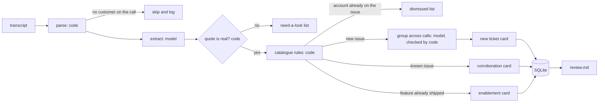
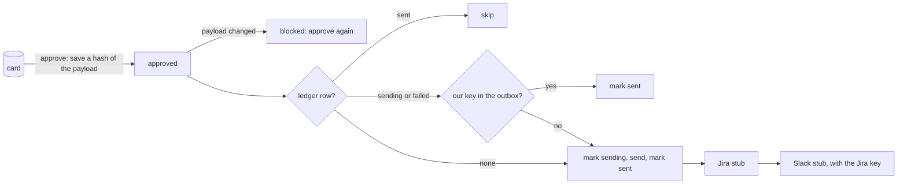

# Requirements, flows and tests

This file connects each requirement in the take-home PDF to the code that does it and the test that proves it.

Each test must fail when we break the code it protects. The mutation check does this for each test (see [TDD_LOG.md](TDD_LOG.md)). Run it with `python solution/scripts/mutation_check.py`.

## How to read the status column

- **Tested:** a test proves it, and the test fails when we break the code.
- **Eval:** the dev-set eval or the demo proves it. There is no unit test for it.

## Flow 1: from a transcript to the review queue

Command: `python -m solution run`

1. The code reads the transcript. It finds the speakers, the line numbers and the call owner.
2. If no customer is on the call, the code skips the call. The model does not see it.
3. The model reads the call one time. It lists each topic that the customer raised. It also lists the topics it does not want to file, and gives a reason for each one.
4. The code checks each issue. The quote must be word for word on a customer line. If the check fails, the issue goes to the "need a look" list.
5. The code applies the catalogue rules. The catalogue decides if an issue is known, shipped, or already reported by this account.
6. The model groups the same issue from different calls. The code checks the groups. If the groups are bad, each issue gets its own card.
7. The code saves each card in SQLite and writes `output/review.md`.

## Flow 2: from approval to Jira and Slack

Commands: `approve`, `edit`, `dispatch`

1. A person reads a card and approves it. The code saves a hash of the exact payload.
2. If the payload changes after approval, the approval stops working. The person must approve again.
3. Before each write, the code records "sending" in the ledger.
4. The code sends the payload. Then it records "sent".
5. If the process stops in the middle, the next run looks for our key in the outbox. If the key is there, the code does not send again.
6. Jira and Slack have different ledger rows. If Slack fails, only Slack tries again.

## The build

| # | What the PDF asks | What does it | Proof | Status |
|---|---|---|---|---|
| B1 | Find real issues from the customer. Ignore chatter, internal talk and noise. | The model finds issues. The code checks that the quote is real and is from a customer. The code skips calls with no customer. | `test_internal_speaker_cannot_be_evidence`, `test_fabricated_quote_is_rejected`, `test_internal_only_call_never_reaches_model`, the "none" cases in the eval | Tested |
| B2 | Do not file a known issue again. Record the new report on the old issue. | The catalogue rules. Corroboration cards. Tickets we filed join the catalogue. | `test_account_already_on_tracked_issue_is_not_corroborated_again`, `test_same_issue_on_two_calls_is_one_ticket`, `test_after_filing_later_calls_corroborate_and_edited_transcripts_do_not_refile` | Tested |
| B3 | Make a Jira payload (title, type, project, body, priority) with a link to the quote. Make a Slack message for the call owner. | `proposals.new_ticket`, `proposals.corroboration` | `test_jira_payload_has_required_fields_and_linked_snippet`, `test_slack_goes_to_the_csm_not_the_support_engineer` | Tested |
| B4 | Nothing files by itself. A person approves first. The review must be fast. | The approval hash. Dispatch sends approved cards only. Each card has its approve command. | `test_nothing_is_written_without_approval`, `test_payload_change_from_rerun_makes_approval_stale`, `test_each_new_ticket_card_is_self_contained_and_actionable`, `test_corroborations_are_batched_and_rejects_are_visible` | Tested |

## The scaffolding

| # | What the PDF asks | What does it | Proof | Status |
|---|---|---|---|---|
| S1 | Say which steps are code and which are the model. The transcript is the source of truth. | `llm.py` is the only file that calls the model. The code checks each quote. See the table in WRITEUP.md. | The quote tests in B1 | Tested |
| S1b | Text in a transcript is data, not a command. | The model has no tools. A person approves each write. The code flags text that looks like a command. | `test_embedded_instruction_produces_no_proposal`, `test_fooled_model_still_cannot_write_and_card_is_flagged` | Tested |
| S2 | Two runs make no duplicate tickets or messages. | The cache, stable keys, the ledger and "settled" evidence. | `test_rerun_and_redispatch_create_no_duplicates`, `test_reordered_reextraction_after_filing_proposes_nothing_new`, the demo (50 writes, then 50 again) | Tested |
| S2b | A crash or a failed write is safe. | "Sending" before each write. The outbox check. Separate Jira and Slack rows. One lock. | `test_crash_after_jira_write_reconciles_instead_of_duplicating`, `test_slack_failure_retries_only_slack`, `test_failed_write_that_may_have_landed_is_never_withdrawn_or_refiled`, `test_concurrent_dispatch_is_refused` | Tested |
| S3 | One bad transcript does not damage the others. | Each call runs alone. A failed model call uses the last good result. A failed grouping gives one card per issue. | `test_one_bad_call_does_not_stop_the_others`, `test_refresh_failure_keeps_previous_extraction_and_approval`, `test_clustering_failure_degrades_instead_of_crashing`, `test_withdrawn_proposal_comes_back_when_produced_again` | Tested |
| S4 | An eval with a pass or fail rule that a second engineer agrees with. | Each dev label has a line span in the transcript. `evaluate.grade` applies the rules. | `test_rules`, `test_unmatched_write_fails_the_call_even_if_cases_pass`, `test_cluster_reference_needs_the_same_ticket`, `test_one_prediction_cannot_satisfy_two_cases` | Tested |
| S4b | Does a case pass every time, not only one time? | `eval --runs 5 --refresh` counts the cases that pass in all runs. | 5 fresh runs: 30 of 30 cases passed in each run | Eval |
| S5 | Logs that show a silent stop or silent wrong filing. | `events.jsonl`, `summary.json` and the `health` command | `test_each_failure_mode_is_flagged`, `test_debug_only_run_does_not_mask_a_stale_full_run`, `test_stuck_delivery_is_flagged`, `test_events_log_has_one_extract_event_per_call_with_model_and_prompt` | Tested |
| S5b | Tell a real miss from a bad grader. | Each failed case names the step that lost it, with line numbers. | `test_diagnosis_names_the_stage_that_lost_the_case` | Tested |

## The evidence files

A first static review (29 Sep) found no numbers for the full run or the eval. The numbers were in the repo, but only in prose and in large reports. These files now state them. A test fails if a file goes missing or stops agreeing with the run.

| What a reviewer asks | File | Proof | Status |
|---|---|---|---|
| Counts for all 140 calls: processed, skipped, filed | `output/run-manifest.md` and `.json` | `test_one_row_per_transcript`, `test_totals_match_rows_and_the_review_queue` | Tested |
| Eval pass rate and variance across runs | `output/eval-numbers.json` | `test_multi_run_numbers_and_variance_are_published` | Tested |
| A second run writes nothing new | `output/idempotency-diff.md` and `.json` | `test_second_dispatch_and_rerun_write_nothing` | Tested |

## What the reviewers look for

| Signal in the PDF | Where to see it |
|---|---|
| Software engineering (the most weight) | Small modules. The ledger and the outbox check. 45 tests. 29 mutations, all caught. |
| Work across systems, and reliability | The given stubs, not changed. The crash, Slack and lock tests. The demo. |
| Good use of AI | The "where AI is" table in WRITEUP.md. The code overrules the model on facts. |
| Output a person can use | Each card in `review.md` has the quote, the lines near it, the reason it is new, the priority reason and the approve command. |
