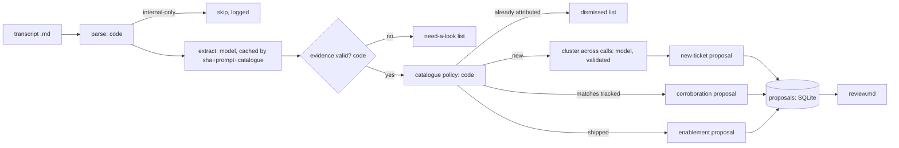
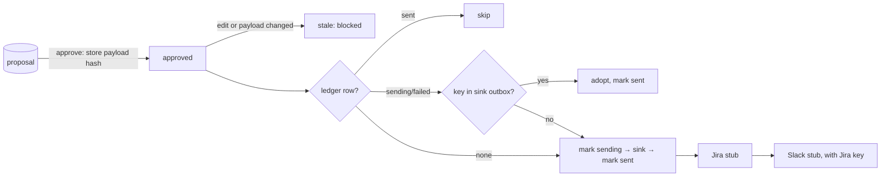

# Requirements → flows → tests

Each requirement in the take-home PDF, the flow that handles it, and the test or evidence that proves it.
Status: **covered** (test exists and was shown to go red when the behaviour breaks, see [TDD_LOG.md](TDD_LOG.md)), **gap** (a red test is written and waiting for review), or **evidence only** (an eval or demo proves it, with no unit test).

## Flow 1: transcript → review queue (`python -m solution run`)

## Flow 2: approval → sinks (`approve` / `edit` / `dispatch`)

## The build (PDF "Given the provided transcripts, your automation should")

| # | Requirement | Flow / code | Proof | Status |
|---|---|---|---|---|
| B1 | Genuine issues from the **external** participant; ignore offhand complaints, internal chatter, noise | extraction prompt (model); `extract.validate` requires an `[EXTERNAL]` line and a verbatim quote; internal-only calls skipped | `test_internal_speaker_cannot_be_evidence`, `test_fabricated_quote_is_rejected`, `test_internal_only_call_never_reaches_model`; dev eval none-cases | covered |
| B2 | De-duplicate against existing issues; note corroboration instead | `validate` (key exists), `apply_policy`, corroboration proposals, cluster against filed tickets | `test_account_already_on_tracked_issue_is_not_corroborated_again`, `test_same_issue_on_two_calls_is_one_ticket`, `test_after_filing_later_calls_corroborate…`; eval corroborate cases | covered |
| B3 | Jira payload (title, type, project, body, severity/priority) **with the transcript snippet linked**, plus a Slack payload **for the call owner** | `proposals.new_ticket`, `corroboration` | only indirectly (the stubs accept the payload) | **gap: T1** |
| B4 | Nothing files automatically; a human approves; review is fast | approval hash, `dispatch` visits approved only, `review.md` | `test_nothing_is_written_without_approval`, `test_edit_after_approval…`, `test_payload_change…stale` | covered for the gate; **gap: T2** (what the reviewer sees) |

## The scaffolding

| # | Requirement | Flow / code | Proof | Status |
|---|---|---|---|---|
| S1 | Explicit about what's deterministic and what's the model; raw transcript is the source of truth | module split (`llm.py` is the only model caller), validator, WRITEUP table | validator tests above | covered |
| S1b | Instructions inside transcripts are data (call-005, call-011) | prompt + the gate: the model has no tools | eval injection writes = 0 | evidence only: **gap: T3** |
| S2 | Running twice creates no duplicate tickets or notifications | extraction cache, stable keys, ledger, settled evidence | `test_rerun_and_redispatch_create_no_duplicates`, demo (50 → 50) | covered |
| S2b | Crash / partial delivery is safe | `sending` before the sink call, outbox reconcile, separate Slack rows | `test_crash_after_jira_write…`, `test_slack_failure_retries_only_slack`, `test_failed_write_that_may_have_landed…`, `test_concurrent_dispatch_is_refused` | covered |
| S3 | One transcript erroring doesn't corrupt the rest | per-call isolation, refresh fallback, degraded clustering, scoped withdrawal | `test_one_bad_call…`, `test_refresh_failure…`, `test_clustering_failure…`, `test_withdrawn_proposal_comes_back…` | covered |
| S4 | Eval with a pass/fail definition a second engineer would agree with | `eval/dev_expectations.json` spans + `evaluate.grade` | eval runs; **the grader itself has no tests** | **gap: T4** |
| S4b | Reliability across repeated runs (pass every time?) | `eval --runs N --refresh`: pass^N, flaky list | 3-run + 5-run reports | evidence only |
| S5 | Structured logs so a silent mis-filing or silent stop is visible | `events.jsonl`, `summary.json`, `health` | untested | **gap: T5** |
| S5b | Tell a genuine miss from the grader being wrong | `evaluate.diagnose`: stage that lost the case, with line numbers | untested | **gap: T4** |

## What we're evaluating (PDF)

| Signal | Where a reviewer sees it |
|---|---|
| Software-engineering depth (weighted highest) | small modules; ledger + reconcile; the test suite; red/green log |
| Cross-system integration + reliability | the real stubs used unmodified; crash / Slack / concurrency tests; the demo |
| AI judgment | the WRITEUP "where AI is" table; the validator overriding the model; caching |
| Translator / stakeholder fit | `review.md` cards: quote, context, why not an existing issue, priority reason, one-line approve command (T2) |

## Gap tests (written red first, in `tests/test_gaps.py`)

- **T1** Jira payload contract: project `PROJ`, type Bug/Feature, a summary ≤120 chars, a body that contains the quote and the `transcripts/call-XXX.md#L<n>` link, P1–P4 priority, `source.link`. Slack goes to the call owner's handle (the CSM, not the support engineer).
- **T2** Review packet: every pending new ticket has a card with the key, the quote, a source link and the `approve` command. Corroborations are listed in the batch table. Findings that fail validation appear under "need a look".
- **T3** Injection: an extraction that marks text as `embedded_instruction` produces no proposal. A model that is fooled into proposing a "P0 wire transfer" ticket still writes nothing until a human approves it.
- **T4** Grader: each rule in `evaluate.py`'s docstring as a table-driven test (right action inside the span passes, outside fails, wrong target fails, unmatched write fails the call, cluster reference, P4 rule, one prediction can't satisfy two cases), and the diagnosis names the stage.
- **T5** Health: exits unhealthy on each of the following: no run in 26h, zero transcripts, a failed call, validator reject rate over 15%, a degraded run, a stuck delivery, an old undispatched approval. Healthy on a clean run. An `--only` run doesn't mask a stale full run.
